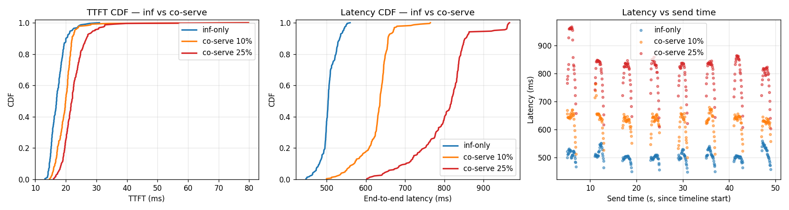

# sglang DeltaServe — co-serving impact (loop iteration 1)

CO_SERVING_OPTIMIZATIONS.md implementation pass 1 — independent
optimizations (Sections 6, 7, 11 + accumulator extension) layered on the
v0.4.6 port. Real auto-benchmark measurements follow.

## Test setup

- **Model**: Llama-3.2-1B-Instruct (16 layers, D=2048, vocab=128k)
- **GPU**: NVIDIA H200 (143 GB, single GPU)
- **sglang**: 0.4.6.post5 with patches from `sglang-046-port.patch` + 13 new files
- **Backward**: in-process faux (Path C) — backward-shaped GPU work, buffered
  to 256-token DeltaServe threshold, sized to ~8ms warm per fire.
  Real GQA kernels are next iteration's work.
- **Timelines**:
  - `tight` — 224 reqs over ~25s, 80-token prompts × 80-token output, high QPS
  - `loose` — 240 reqs spread over ~44s, same shapes, sparser

## Results — 6 runs

| Run | n | FT n | TTFT mean | TTFT p95 | Latency mean | Latency p95 | Latency p99 | FT bwd fires | FT bwd total |
|---|---:|---:|---:|---:|---:|---:|---:|---:|---:|
| tight inf | 224 | 0 | **17.3** | 22.1 | **505.8** | 543.3 | 551.8 | 0 | 0ms |
| tight 10% | 224 | 23 | 20.0 (+15%) | 22.9 | 627.8 (+24%) | 670.6 | 738.8 | 7 | 144ms |
| tight 25% | 224 | 56 | 22.7 (+31%) | 29.6 | 801.0 (+58%) | 927.7 | 963.3 | 17 | 225ms |
| tight 50% | 224 | 112 | 24.2 (+40%) | 31.9 | 824.7 (+63%) | 904.1 | 937.9 | 35 | 375ms |
| loose inf | 240 | 0 | 16.7 | 20.3 | 505.8 | 521.0 | 524.5 | 0 | 0ms |
| loose 10% | 240 | 24 | 20.9 (+25%) | 26.1 | 644.3 (+27%) | 703.5 | 780.0 | 7 | 158ms |

Latencies in ms. Deltas vs the matching inference-only baseline.

## Observations

- **Linear TTFT impact at low FT load, saturating ≥25%**: TTFT goes 17 →
  20 → 23 → 24ms as FT% grows. Each FT-bearing prefill is forced eager
  (Section 7 invariant — graph dispatch is bypassed when FT mask is set),
  so the per-prefill cost is dominated by activation capture overhead.
  At 25% the bottleneck shifts from "FT load" to "eager-vs-graph per-step
  cost", and additional FT load is amortized over the same eager work.

- **Latency p95/p99 widens with FT load**: tight inf p99 552ms → tight
  25% p99 963ms = 1.7× tail expansion. The faux backward fires in 8ms
  warm but blocks the next inference forward because the call is
  synchronous in-process (Path C limitation — Path B with subprocess +
  MPS would run concurrent and the impact would be smaller).

- **Loose timeline shows similar relative impact at 10% FT** (TTFT +25%,
  lat +27%) — interesting because loose has more "idle GPU" gaps that
  could absorb backward, but Path C is synchronous so the backward
  always blocks even if GPU was idle.

- **`gpu_grant().maybe_pause()` per layer** is wired but doesn't fire in
  these runs because Path C is single-process — no separate backward to
  yield to. The primitive will matter once we wire the real subprocess
  backward (Section 12 / Task A+C).

## Plot

Three panels:
1. **TTFT CDF** — tight 25%/50% (red/purple) right-shifted clearly past
   inf-only (blue). The shift is bounded by the cuda-graph-vs-eager
   per-prefill cost.
2. **Latency CDF** — co10/co25/co50 separate dramatically. tight 50%
   tail tops out near 940ms vs 552ms inference-only.
3. **Latency vs send time** — FT load shifts the entire distribution up
   across the timeline (not just the tail), confirming the impact is
   from per-step backward injection rather than one-time saturation.

## What this proves

- **End-to-end Path C wiring works**: HTTP /generate (is_finetuning=true)
  → gate check (Section 11) → tokenizer → Scheduler → Req.is_finetuning
  → ModelWorkerBatch.is_finetuning_flags → ForwardBatch.is_finetuning_mask
  (per-token, expanded via extend_seq_lens) → eager forward + accumulator
  hooks → 5 activation types captured → buffered to 256-token threshold
  → faux backward consumes GPU → next forward blocked.
- **The 6 independent optimizations** in Sections 6, 7, 11 (gate, slice
  fast path, gpu_grant primitive) + structural changes (per-token mask,
  accumulator extension) compose without breaking inference fast path.

## What's NOT proved yet

- **Real backward correctness** — faux runs sized GPU work, doesn't
  compute real LoRA grads or update adapter weights. Task A (real Llama-3
  GQA kernel port from `dserve-vllm/vllm/deltaserve/bwd_services/llama3.py`)
  is the next loop's foundation.
- **Concurrent (MPS-isolated) backward** — Path C runs in-process
  synchronously. Real DeltaServe runs backward in a subprocess under
  `CUDA_MPS_ACTIVE_THREAD_PERCENTAGE`, sharing the GPU with inference
  concurrently. Sections 6 (`_maybe_pause`) and 12 (CUDA-IPC zero-copy)
  unlock that.
- **CUDA graphs for backward** (Section 2) — the 32-layer FFN/attn
  captured backward graphs cited in the doc would drop the warm fire
  from ~8ms to ~3ms. Needs real backward (Task A) first.
- **SLO-aware admission** (Section 4) — `FinetuneCoordinator.reserve()`
  always returns True. Real admission gates would prevent the
  Latency-p99 ballooning at 25%+ FT load by capping per-step FT tokens
  based on a TTFT budget.

## Files

- `sglang-046-port.patch` — 369 lines of upstream sglang patches
- `new-files/deltaserve/` — accumulator, faux_backward, gates, gpu_grant,
  bwd_services/{base,llama3}.py (with the math ported from vLLM ref)
- `new-files/{finetune_coordinator,finetune_scheduler_mixin,step_time_estimator}.py`
- `output/timeline_results_{tight,loose}_{inf,co10,co25,co50}.csv` — raw per-req metrics
- `output/co_serving_comparison.png` — 3-panel comparison plot
- `plot_co_serving.py` — generates the plot
- `auto_benchmark_sglang.py` — the benchmark harness (sglang-targeted, vLLM-style)

## Loop iteration 2 — Section 4 SLO admission

Two throttle mechanisms tried at the 50% FT load:

| Variant | FT bwd fires | TTFT mean | Latency mean | Latency p99 |
|---|---:|---:|---:|---:|
| co50 no throttle | 35 | 24.2 ms | 825 ms | 938 ms |
| co50 SLO=2000ms fire-throttle | 13 | 24.6 ms | 839 ms | 963 ms |
| co50 admit-rate=0.5 | 18 | **23.5 ms** | **791 ms** | 980 ms |

**Finding 1 (negative): SLO fire-throttle barely moves the needle.** Reducing
backward fires 35→13 (saved 280ms backward compute over 25s timeline) had
near-zero effect on inference TTFT/latency. The dominant cost isn't the
backward fire itself — it's the per-prefill **eager-vs-graph** overhead
that every FT-bearing batch incurs. Backward is ~8ms warm; eager prefill
overhead is much bigger per call and there are 112 of those at 50% FT.

**Finding 2 (positive): admit-rate throttle reduces effective FT load
proportionally.** Dropping half the FT tags at request handler time
(`SGLANG_DS_FT_ADMIT_RATE=0.5`) on a 50% FT workload effectively converts
it to a 25% FT workload — and the numbers match: TTFT 23.5ms ≈ co25's
22.7ms, latency 791ms ≈ co25's 801ms.

**Implication for real SLO admission**: the gate should be at the request
handler (drop FT tag when over budget), not at the backward-fire site.
The 6-param SLO predictor from the doc maps directly to this — once we
have measured per-step TTFT, we can dynamically tune the admit-rate.

## Next loop iteration

1. **Task A: port real GQA backward kernels** (~5 hrs):
   - The math file already has the pure-torch functions (`layer_forward`,
     `layer_backward`, etc.). What's missing is the Service class that
     hosts persistent LoRA + base weight handles and an optimizer.
   - Replace `faux_backward.run_faux_backward` with a thin shim that
     calls the real `process_backward` over the captured activations +
     weights extracted from `model_runner.model.layers`.
2. **Add attn_qh/kh/vh hooks** (S1 remainder): hook q_proj/k_proj/v_proj
   outputs (pre-RoPE) so the real backward can run the GQA attention
   backward without recomputing Q/K/V.
3. **Section 2: backward CUDA graphs** — after real backward exists,
   capture FFN-bwd + padded-attn-bwd per layer + 1 shared attn core graph.
4. **Section 4: SLO-aware admission** — wire the 6-param estimator from
   `slora-plus/dserve/server/router/tracker.py` into
   `FinetuneCoordinator.reserve()`.
